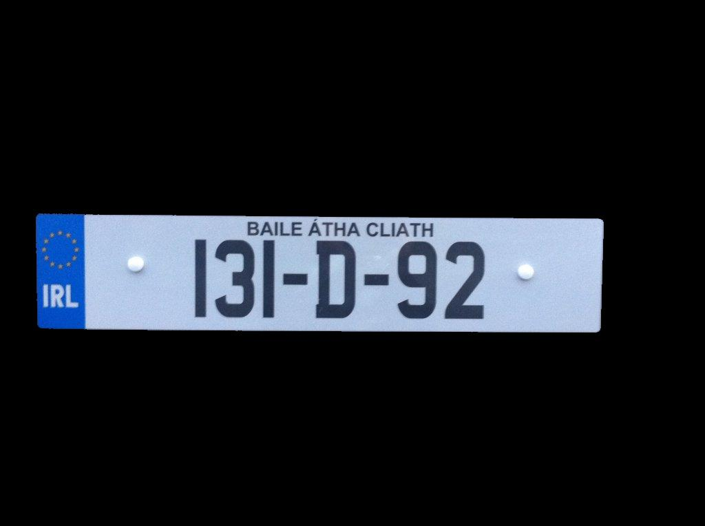
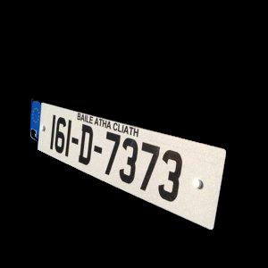
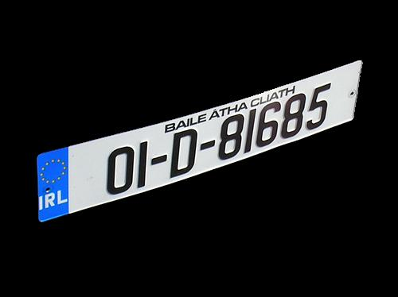
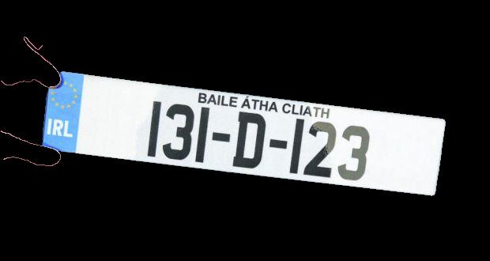

**License Plate Object Identification**
========================

Introduction
------------------------
This project aims to find (and isolate by masking) the **registration plate** in the image [Reg.jpg](Reg.jpg) using MATLAB. Algorithms will be demonstrated on this specific image but they are designed in a general way so they will work on similar images. All designs aim to be as automated as possible. 

| Original | Result |
| :---: | :---: |
|  |  |
|  |  |
|  |  |
|  |  |

Development
------------------------
This project is divided and marked by weekly progress. [Weekly Progress Blogs](/blogs) are used to record the related research into an area of computer vision and implementation of an algorithm design in MATLAB. 

[Week 1: Contrast Stretching](http://chenyumin.com/p/license-plate-object-detection-1-contrast-stretching)

[Week 2: Thresholding](http://chenyumin.com/p/license-plate-object-detection-2-thresholding)

[Week 3: Edge Detection](http://chenyumin.com/p/license-plate-object-detection-3-edge-detection)

[Week 4: Color Segmentation](http://chenyumin.com/p/license-plate-object-detection-4-color-segmentation)

[Week 5: Finishing Up](http://chenyumin.com/p/license-plate-object-detection-5-finishing-up)

Licensing
------------------------
Please see the file named [LICENSE.md](LICENSE.md).

Author
------------------------
* [Chen Yumin](//www.chenyumin.com)
* Paul Sheehan
