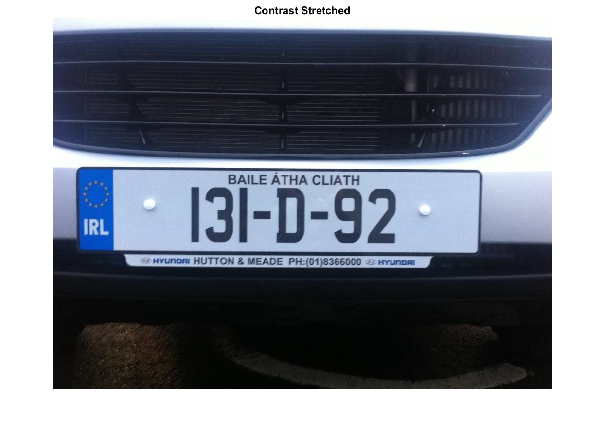
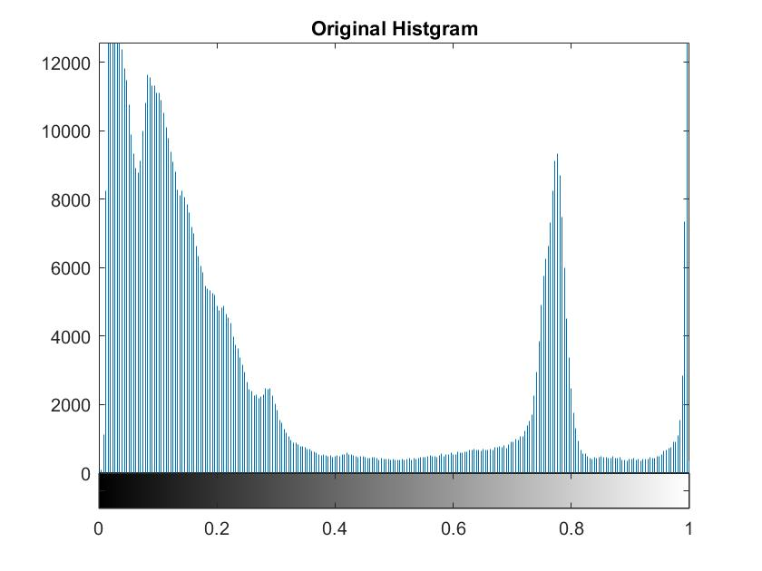
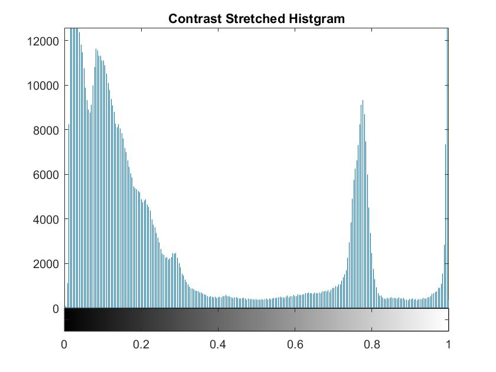

**Contrast Streched**
========================
<sup>*This is a blog entry from [License Plate Object Identification Blogs](./README.md).*</sup>

The contrast stretching uses statistics [three-sigma rule][1] to bound to 99.73% of data.

```matlab
gMin = min(gray(:));
gMax = max(gray(:));
gStd = std(gray(:));
% Apply statistics three-sigma rule to bound to 99.73% of data
gLowerBound = max(gMin, (gMax + gMin) / 2 - gStd * 3);
gUpperbound = min(gMax, (gMax + gMin) / 2 + gStd * 3);
contrastStretched = (image - gLowerBound) / (gUpperbound - gLowerBound);
```

Results:

| Original | Contrast Streched |
| :---: |:---:|
|  |  |
|  |  |

From the results we can see that there isn't a noticeable change in these two images before and after the contrast streching. But because this project aims to develop a general algorithm that would work on other similar images as well. Contrast stretching, or normalization, is neccessary to help make this program more automated.


References
------------------------
* [Wikipedia: 68–95–99.7 rule][1]  

[1]: https://en.wikipedia.org/wiki/68%E2%80%9395%E2%80%9399.7_rule "68–95–99.7 rule"


<br>
------------------------
Next: [Week 2: Thresholding](./week2.md)