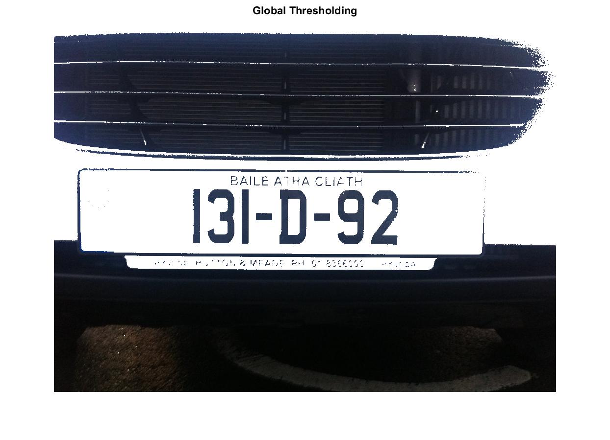

**Thresholding**
========================
<sup>*This is a blog entry from [License Plate Object Identification Blogs](./README.md).*</sup>

In this week, different types of thresholding is implemented as a method of segmentation.  

| Original | Global Thresholding | Adaptive Thresholding |
| :---: |:---:| :---:|
|  |  |  |  

Global thresholding is an unsophisicated segmentation technique that can seperate between the two peaks in the image. Previously, this was implemented using grayscale image. `blackWhite = double(contrastStretched > threshold);` This would result in a black and white output (See: [main.m](https://github.com/CharmySoft/license-plate-object-identification/blob/0eef0f0a49d873441912e2c860541058049a29ac/main.m#L34)).  

This is then further extended for colored images:

```matlab
threshold = mean(contrastStretched(:));
globalThresholding = image;
% Loop through each pixel for global thresholding
for x = 1:width
    for y = 1: height
        if mean(contrastStretched(y, x, :)) > threshold
            % Wipe out the pixel if larger than threshold
            globalThresholding(y, x, :) = 1;
        end            
    end
end
```
The threshold is compared with the mean of the red, green, and blue values of a pixel.

On the other hand, [Adaptive thresholding][1] is a form of thresholding that takes into account spatial variations in illumination.

```matlab
adaptiveThresholding = image;
half = 3;
% Loop through the image to apply threshold to each pixel
for x = half + 1:width - half
    for y = half + 1: height - half
        area = contrastStretched(y-half:y+half, x-half:x+half, :);
        threshold = mean(area(:)) - 0.05;
        if mean(contrastStretched(y, x, :)) > threshold
            % Wipe out the pixel if larger than threshold
            adaptiveThresholding(y, x, :) = 1;
        end            
    end
end
```
The code above uses the cookie-cutter technique to scan through the entire image using a tiny 7x7 area *cookie* to decide its threshold, and thus the name adaptive thresholding.


References
------------------------
* [Adaptive Thresholding by R Fisher et al, Edinburgh University][1]  

[1]: http://homepages.inf.ed.ac.uk/rbf/HIPR2/adpthrsh.htm "Adaptive Thresholding"
<br>

------------------------
Previous: [Week 1: Contrast Streching](./week1.md)  
Next: [Week 3: ...](./week3.md)
