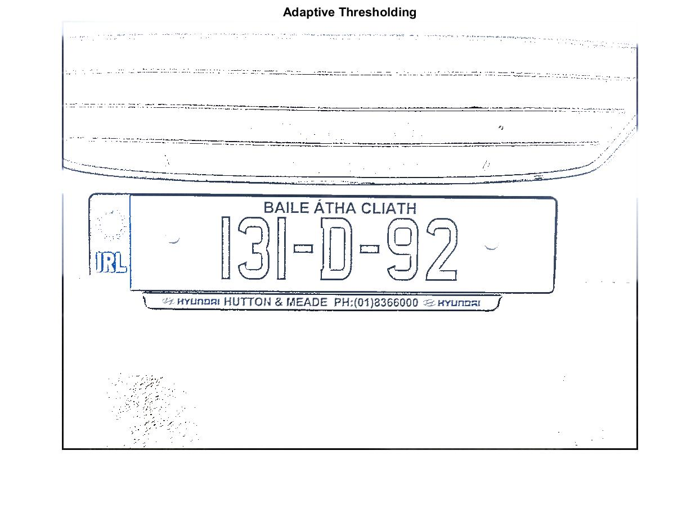
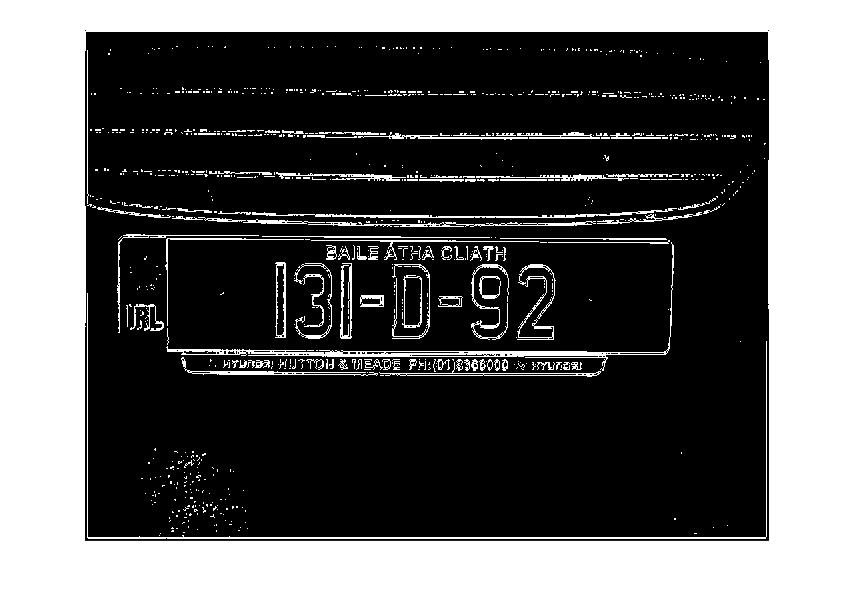
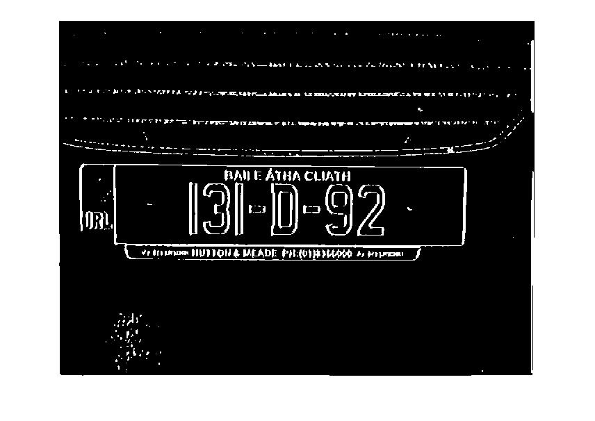

**Edge Detection**
========================
<sup>*This is a blog entry from [License Plate Object Identification Blogs](./README.md).*</sup>

This week, our registration plate image is enhanced by introducing Edge Detection. The previously thresholded image is further transformed so that it is better suited for the detection of the licence plate.

The aim for the enhancment process is to get clear black lines of the surrounding licence plate. We can then perform an edge detection algorithm to identify corners in the rectangular licence plate. 

A Sobal filter kernal is created for both the X and Y axis of our image. The Y kernal is just a 90 degree rotation of the X kernal.
Using the Sobel filter kernal 2d-convolution is applied on the image to emphazise lines on the X and Y axis.

```matlab
% Apply gausian filter to the thresholded image
adaptiveThresholding = imgaussfilt(adaptiveThresholding, 2);
% This is the sobel filter kernal
sobelX = [-1 0 1;
         -2 0 1;
         -1 0 1]/4;
     
sobelY = [-1 -2 -1;
         0 0 0;
         1 2 1]/4;
```
         
Using the formula of Pythagorus Thoerem, we can get the gradient magnitude of our image. We then use a threshold of 0.2 in order to seperate the lines we detected using Sobal, from the image that we just convoluded. 

```matlab
% Apply gausian filter to the thresholded image
adaptiveThresholding = imgaussfilt(adaptiveThresholding, 2);

%Apply sobel filter to emphasize lines on the X and Y axis
edgeDetectionX = conv2(adaptiveThresholdingGray, sobelX);
edgeDetectionY = conv2(adaptiveThresholdingGray, sobelY);

% Get the gradient magnitude of the image using use Pythagorus Thoerem
magnitude = sqrt(edgeDetectionX.^2 + edgeDetectionY.^2);
edgeDetection = (magnitude - min(magnitude(:)))/max(magnitude(:)) - min(magnitude(:));

% Using the threshold of 0.2 to seperate lines of high 
% (after adaptive thresholding)
edgeDetection = edgeDetection > 0.2;
edgeDetection = ~edgeDetection;
```

The result is a black and white image with very thick lines around the rectangular licence plate, where originally the lines were broken at some of the corners. The image is then inverted.


It was discovered that the lines could be made thicker if I applied a Gaussian filter to the image before applying Sobal.

| Adaptive Thresholding | Sobal without Gaussian | Sobal with Gaussian|
| :---: |:---:| :---:|
|  |  | |

References
------------------------
* [Sobel Edge Detector by R Fisher et al, Edinburgh University][1]  

[1]: http://homepages.inf.ed.ac.uk/rbf/HIPR2/sobel.htm "Sobel Edge Detector"
<br>

------------------------
Previous: [Week 2: Thresholding](./week2.md)  
Next: [Week 4: Color Segmentation](./week4.md)