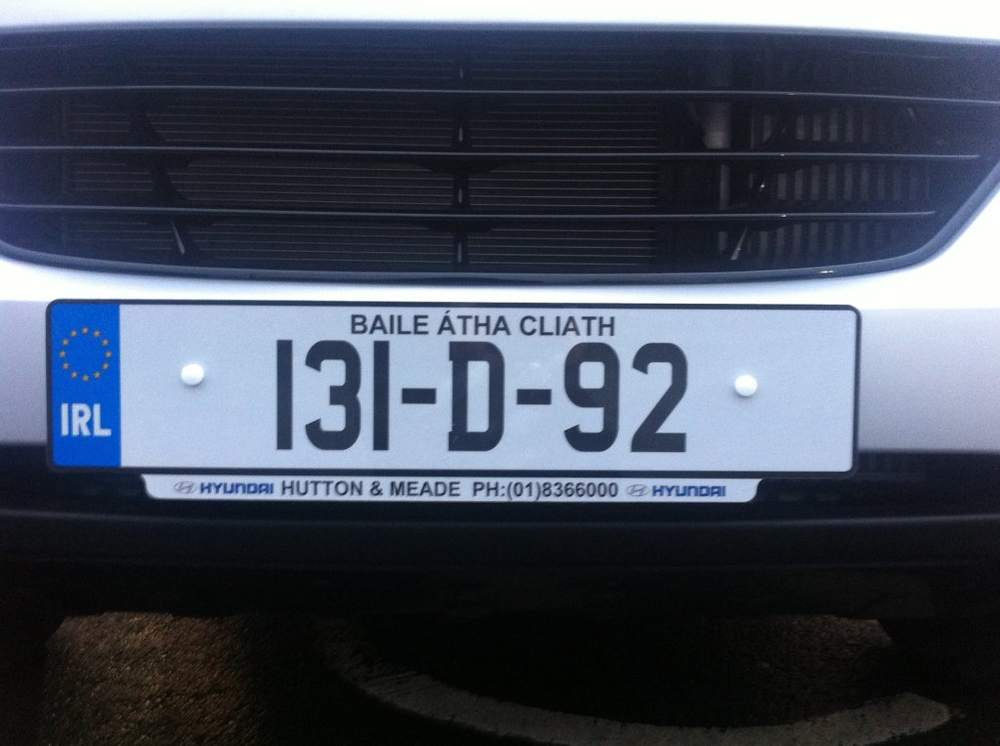

**Finishing Up**
========================
*This is a blog entry from [License Plate Object Identification Blogs](./README.md).*

This project is finished.  

The basic method for extracting the license plate region can be described by the following steps.
1. Input of the original image  
2. Normalization (Contrast Stretching)  
3. Identification of the blue vertical band to the left of the plate  
4. Edge detection  
5. Morphological operation  
6. Finding the license plate region  

Results:

| Original | Result |
| :---: | :---: |
|  |  |
|  |  |
|  |  |
|  |  |

         

 

------------------------
Previous: [Week 3: Edge Detection](./week3.md)  
Next: [Week 5: ...s](./week5.md)